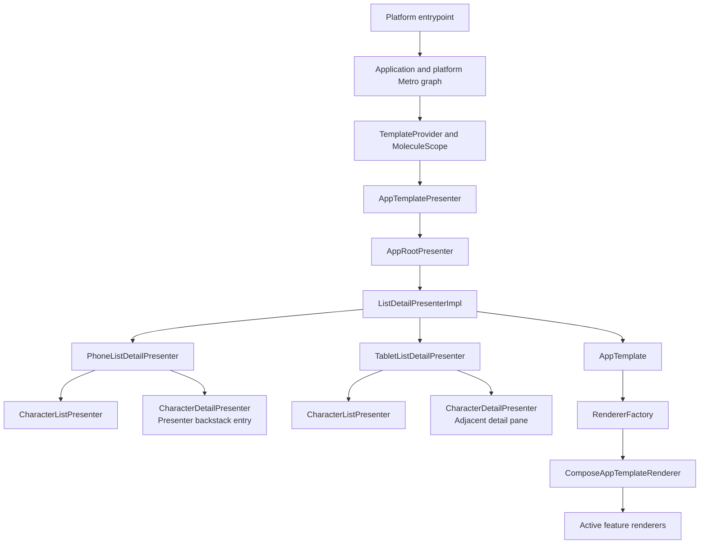
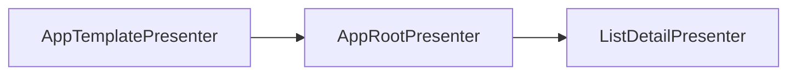
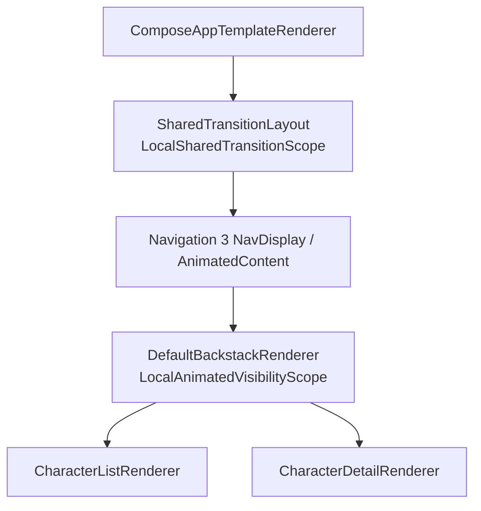

# List Detail Blueprint

This is an advanced Kotlin Multiplatform blueprint built with
[App Platform](https://github.com/vRallev/app-platform). Platform-specific app shells stay thin
while shared presentation, rendering, theme, navigation, dependency-injection, and application
lifecycle code lives in reusable modules. Android, iOS, desktop, and web therefore run the same
feature presenters and Compose renderers.

All Gradle build scripts use the Groovy DSL.

## What the sample demonstrates

The app presents 15 Middle-earth characters in an adaptive list-detail experience:

- Phones and portrait windows show a full-screen list and push a detail screen after selection.
- Single-pane navigation shares the selected character's image, name, and age with the detail
  screen.
- Landscape windows at least 600 dp wide show a fixed 384 dp list pane beside the selected detail.
- Selection survives switching between the phone and tablet presentations.
- The first character is selected automatically when the two-pane layout opens without a valid
  selection.
- Presenters and renderers remain platform-independent and are assembled through Metro.
- Strings and images are Compose Multiplatform resources shared by every target.

Character ages are sample data for 25 March, T.A. 3019, when the One Ring was destroyed. Values are
approximate where Tolkien's chronology does not establish an exact age. The 1024×1024 portraits are
original AI-generated assets bundled with the project; the app does not use movie stills,
third-party images, or runtime image URLs.

## Architecture overview

App Platform separates state production from rendering:

- A `MoleculePresenter<Input, Model>` is a composable state machine. It reads observable state,
  composes child presenters, and emits immutable render models with explicitly named callbacks.
- A `Renderer<Model>` turns one model type into platform UI.
- `RendererFactory` resolves renderers by the runtime model type, allowing parents to compose
  polymorphic child models without importing their concrete renderers.
- A `Template` provides the stable outer application layer around the active feature.
- App Platform scopes and Metro own object lifetimes and assemble the dependency graph.

The runtime flow is:



The presenter tree produces models only. Renderers do not call presenters, mutate repositories, or
decide which adaptive presentation should be active.

## Module structure

The blueprint follows App Platform's `public`, `impl`, `testing`, and `app` module boundaries.
Reusable modules depend on public APIs; the application assembly module is the deliberate point
where implementations meet.

| Module | Responsibility |
| --- | --- |
| `:app:android` | Android application manifest, launcher assets, and `Application` entrypoint |
| `:app:desktop` | Desktop window, packaging, app icon, and Hot Reload entrypoint |
| `:app:web` | Wasm entrypoint, HTML shell, web manifest, and browser icons |
| `app/ios` | SwiftUI/Xcode shell and iOS asset catalog |
| `:app-framework:impl` | Root scope, Metro graph assembly, template stream, and shared platform integration |
| `:app-framework:impl-ui-test-robots` | Android and Desktop test graphs, lifecycle fixtures, and UI-test rules |
| `:list-detail:public` | Reusable feature contract, character entities, and repository interface |
| `:list-detail:impl` | Repository implementation, presenters, render models, Compose renderers, and resources |
| `:list-detail:impl-robots` | Shared, layout-agnostic Compose robots for list and detail interactions |
| `:list-detail:testing` | Fake repository for presenter and consumer tests |
| `:presenter-navigation:public` | Default presenter-backstack model and creation function |
| `:presenter-navigation:impl` | Navigation 3 renderer for the default backstack |
| `:templates:public` | App template contract, screen-size APIs, and shared-transition composition locals |
| `:templates:impl` | Outer Compose template renderer and screen-size reporting implementation |
| `:theme:public` | Material 3 theme plus the `AppTheme` proxy used by feature renderers |
| `buildSrc` | Convention plugins for targets, dependencies, formatting, Detekt, packaging, and module checks |

Only application modules should assemble concrete `impl` modules. The
`checkModuleStructureDependencies` task verifies these boundaries.

## Presenter composition

### Application and template presenters

Each platform creates an [`Application`](app-framework/impl/src/commonMain/kotlin/software/ralf/app/platform/listdetail/Application.kt)
and a platform-specific final Metro graph. The application owns the App Platform root `Scope` and
its app-scoped dependencies.

[`TemplateProvider`](app-framework/impl/src/commonMain/kotlin/software/ralf/app/platform/listdetail/TemplateProvider.kt)
creates an independently cancellable `MoleculeScope` and launches this presenter chain:



`AppTemplatePresenter` installs the back-gesture dispatcher in the presenter composition and wraps
the root feature model in `AppTemplate.FullScreenTemplate`. `AppRootPresenter` is intentionally
small: it exposes the feature as the application's root model.

The resulting `StateFlow<AppTemplate>` is the only stream platform entrypoints need to collect.

### Adaptive parent presenter

[`ListDetailPresenterImpl`](list-detail/impl/src/commonMain/kotlin/software/ralf/app/platform/listdetail/ListDetailPresenterImpl.kt)
is the adaptive parent. It observes `ScreenSizeProvider`, owns a
`ListDetailSelectionState` with `remember`, and chooses exactly one child presentation:

```text
ScreenSize.Category.PHONE  -> PhoneListDetailPresenter.Model
ScreenSize.Category.TABLET -> TabletListDetailPresenter.Model
```

Its own `Model` implements `ModelDelegate`. Renderer lookup therefore passes through the adaptive
wrapper to the concrete phone or tablet model. This keeps the public `ListDetailPresenter`
contract at `BaseModel` while letting both presentations expose models appropriate to their layout.

The selection state is composition-owned rather than app-scoped. It lives for the lifetime of the
presented feature, survives adaptive layout changes, and is discarded when that feature leaves the
composition.

### Reusable list and detail presenters

The adaptive presentations reuse the same leaf presenters:

- `CharacterListPresenter` observes `CharacterRepository.characters` and emits list content plus
  the selected identifier.
- Its parent copies the model with an `onCharacterSelected` callback appropriate to the active
  presentation. On a phone the callback pushes a detail presenter; on a tablet it replaces the
  current selection.
- `CharacterDetailPresenter` is assisted-injected with a `Character` and `showBackButton`.
  Phone details can pop the active backstack, while tablet details omit back navigation.

This callback design keeps the list presenter independent of navigation and layout. Models carry
explicit UI events upward; child presenters do not reach into their parents.

## Adaptive behavior

`ComposeAppTemplateRenderer` reads `LocalWindowInfo.containerDpSize` and publishes distinct,
specified measurements through `DefaultScreenSizeProvider`. Presentation code consumes only the
read-only `ScreenSizeProvider` interface.

The category rule is intentionally simple:

| Category | Condition | Presentation |
| --- | --- | --- |
| `TABLET` | Width is at least 600 dp and greater than height | Two-pane list and detail |
| `PHONE` | Every other window, including all portrait and square windows | Single-pane backstack |

### Phone and portrait presentation

`PhoneListDetailPresenter` creates a presenter backstack whose initial entry is the character list.
Selecting a row performs two actions:

1. Update the adaptive parent's selection state.
2. Push an assisted `CharacterDetailPresenter` with `showBackButton = true`.

The system back gesture and detail toolbar button both pop the backstack. The phone model delegates
to `DefaultBackstackModel`, and `DefaultBackstackRenderer` renders each Navigation 3 entry through
`RendererFactory`.

### Tablet landscape presentation

`TabletListDetailPresenter` presents list and detail state simultaneously. It resolves the selected
character from the repository and falls back to the first character when the selection is absent
or no longer valid.

The resulting state is explicit:

- `Model.Content` always contains a non-null list model and detail model.
- `Model.Empty` represents an empty repository and lets the renderer show an empty-state message.

`TabletListDetailRenderer` gives the list a fixed 384 dp leading pane and lets the detail consume the
remaining width. Selecting a row updates state in place rather than creating a navigation entry.

### Switching layouts

Because `ListDetailPresenterImpl` owns the selected identifier above both adaptive presenters, the
selection survives a resize. For example, selecting a character on a phone and widening the window
opens that character in the tablet detail pane. Returning to the phone presentation shows the list
with the same row selected; the Navigation 3 backstack itself remains an implementation detail of
the phone presentation.

## Rendering and themes

Concrete renderers use `@ContributesRenderer`, allowing Metro to register them with App Platform's
`RendererFactory`. Parent renderers accept `BaseModel` children and resolve their renderers at
runtime. This is used by the app template, presenter backstack, and tablet split layout.

`ComposeAppTemplateRenderer` owns application-wide rendering concerns:

- Provide the current `ScreenSize` through `LocalScreenSize`.
- Install the standard Material 3 `ListDetailTheme`.
- Apply background and content colors through the `AppTheme` proxy.
- Apply safe drawing insets around feature content.
- Forward platform back events into the presenter tree.
- Install the shared-transition root described below.

Feature renderers use `AppTheme.colorScheme` and `AppTheme.typography` instead of accessing
`MaterialTheme` directly. This keeps theme access behind the blueprint's public theme API.

User-facing strings live in Compose resource XML files. Character images are resolved from the
local `CharacterPortrait` enum to bundled Compose drawable resources, so rendering requires no
network access.

## Shared element transitions

Phone and portrait navigation animates three matching elements between a list row and the detail
screen:

- Portrait
- Character name
- Age when the Ring was destroyed

The transition requires two different scopes:



`SharedTransitionLayout` must sit above both outgoing and incoming content, so it belongs to the
outer template renderer. The `AnimatedVisibilityScope` is entry-specific and is created inside
Navigation 3's `NavDisplay`, so `DefaultBackstackRenderer` bridges
`LocalNavAnimatedContentScope.current` into the blueprint's generic
`LocalAnimatedVisibilityScope`.

`CharacterSharedElementKey` combines the character identifier with the element type. This prevents
the name, age, or portrait of one row from matching another row while outgoing and incoming
backstack entries are composed at the same time. The renderers use `sharedBounds`, allowing bounds,
typography, image size, and clipping to change between the two screens.

The modifier deliberately becomes a no-op when:

- The adaptive category is `TABLET`, where list and detail are visible simultaneously.
- No `SharedTransitionScope` is installed.
- The current content is not hosted in an animated visibility scope.

This makes the feature renderers safe in previews, tests, the tablet split view, and alternative
hosts.

The shared-transition API is not inherently tied to Navigation 3. A different child renderer can
use `AnimatedContent` or `AnimatedVisibility` and provide its own scope:

```kotlin
AnimatedContent(targetState = model.content) { content ->
  CompositionLocalProvider(
    LocalAnimatedVisibilityScope provides this,
  ) {
    rendererFactory.getComposeRenderer(content).renderCompose(content)
  }
}
```

The nearest provider supplies the animation scope for that subtree while the app-wide
`SharedTransitionLayout` continues to coordinate matching elements.

## State and lifecycle

The sample deliberately separates state by lifetime:

| State | Owner | Lifetime |
| --- | --- | --- |
| Root dependency graph and application coroutine scope | `Application` | Platform application instance |
| Window measurements | `DefaultScreenSizeProvider` in App scope | Application graph |
| Current character selection | `ListDetailPresenterImpl` composition | Presented list-detail feature |
| Phone navigation entries | Presenter backstack | Active phone presentation |
| Template model stream | `TemplateProvider` and its `MoleculeScope` | Platform UI host |

Android retains its `TemplateProvider` in `MainActivityViewModel`, so the presenter stream survives
Activity recreation. Desktop and web own it in their app runtime objects. iOS remembers it inside
the Compose view controller and cancels it when that composition is disposed. Every platform
ultimately renders the same `AppTemplate` through an App Platform Compose renderer factory.

## Platform entrypoints

| Platform | Bootstrap |
| --- | --- |
| Android | `AndroidApplication` creates the root graph; `MainActivityViewModel` owns the template stream; `MainActivity` collects and renders it |
| iOS | The SwiftUI shell calls `MainViewController`, which hosts Compose Multiplatform in a `UIViewController` |
| Desktop | `Main.kt` creates a Compose window and delegates shared setup to `DesktopApp` |
| Web | `Main.kt` creates the browser canvas and delegates shared setup to `WasmJsApp` |

Platform source sets provide final Metro graphs for platform-specific dependencies. Shared graph
interfaces remain in `commonMain`.

## Testing

The sample separates presenter tests, reusable robot APIs, and platform integration tests.

### Presenter tests

Presenter tests run without platform UI. `FakeCharacterRepository` provides deterministic data,
while App Platform's Molecule test utilities collect emitted models. These tests verify:

- Adaptive delegation to phone and tablet presenters.
- Phone selection, detail push, and back navigation.
- Tablet auto-selection and detail replacement.
- Selection preservation when resizing from phone to tablet.
- Explicit empty tablet state.

`ScreenSizeTest` independently verifies the adaptive threshold, square-window behavior, and
portrait behavior.

### Robot modules

`:list-detail:impl-robots` contains feature-focused `ComposeRobot` implementations:

- `CharacterListRobot` verifies and selects character rows.
- `CharacterDetailRobot` verifies localized detail content and optional back navigation.

The robots use stable semantics tags exposed by the feature renderers and deliberately do not
encode phone or tablet layout decisions. The same operations work whether list and detail occupy
separate navigation entries or are visible together. They are registered in the Metro test graph
with `@ContributesRobot`, so test code resolves them with `composeRobot<Robot>()` instead of
constructing them manually.

App Platform's module-structure plugin automatically gives `:list-detail:impl-robots` an
implementation dependency on its sibling `:list-detail:impl` module. The robot module therefore
does not repeat that structural dependency in its build file.

`:app-framework:impl-ui-test-robots` is the application-level test fixture. It depends on the
feature robot module and provides:

- `TestAndroidAppGraph` and `TestDesktopAppGraph`, which combine production bindings with
  test-only robot contributions.
- `AndroidUiTestRule`, which launches `MainActivity`, lets the device determine the adaptive
  presentation, disables system animations, and destroys the root scope after each test.
- `DesktopUiTestRule`, which creates a fresh `DesktopApp`, installs its root scope for robot
  lookup, renders at a controlled phone or tablet size, and tears down the application.

Production app modules depend on these modules only from test configurations. Robot code and test
graphs therefore never enter application artifacts.

### Platform integration tests

The integration scenarios themselves are intentionally not shared:

```text
app/android/src/androidTest/.../ListDetailAndroidUiTest.kt
app/desktop/src/desktopTest/.../ListDetailDesktopUiTest.kt
```

Each platform has its own test class and lifecycle, while only the layout-agnostic robot vocabulary
is reused. The suites provide three platform tests across two end-to-end behaviors:

1. Android and Desktop each verify that a phone opens Samwise's detail through the presenter
   backstack and returns to the list.
2. Desktop additionally verifies that a landscape tablet starts with Frodo selected and replaces
   the detail with Aragorn without exposing back navigation.

Android tests use a custom instrumentation runner and test application to install the robot-aware
Metro graph. Gradle Managed Devices runs them on a Pixel 3 API 30 `aosp-atd` image through AndroidX
Test Orchestrator. Android does not force an orientation or emulate tablet coverage; its device
configuration determines the presentation. Desktop tests run against controlled Compose test
scenes matching the production phone and tablet window presets.

There are deliberately no iOS integration tests or shared cross-platform integration-test source
sets in this blueprint.

Run the integration suites independently:

```bash
./gradlew :app:desktop:desktopTest
./gradlew :app:android:emulatorCheck
```

The GitHub Actions workflow gives Android and Desktop integration tests separate jobs. The Desktop
unit-test job discovers every `desktopTest` task and excludes only the app integration-test task,
so future library modules are covered automatically. Android prepares hardware acceleration before
starting the managed emulator, and both integration jobs upload test reports on failure. Unit
tests, static analysis, module checks, and platform builds remain separate so failures identify the
affected architectural layer.

## Extending the blueprint

- Create a dedicated module family for each new feature, following `:list-detail`; do not add
  unrelated feature code to the list-detail modules.
- Put reusable contracts and entities in that feature's `:public` module, and concrete presenters,
  presenter models, repositories, renderers, and resources in its `:impl` module.
- Keep presenter models nested inside their presenter when they are implementation details.
- Create a `:testing` module in each feature family that needs reusable fakes.
- Create an `:impl-robots` module in each feature family that needs shared UI interactions; keep
  platform launch behavior in `:app-framework:impl-ui-test-robots`.
- Keep integration-test classes in their platform app source sets; share robot operations rather
  than complete test scenarios.
- Put localized text and feature images in `commonMain/composeResources`.
- Add a new renderer with `@ContributesRenderer`; resolve polymorphic children through
  `RendererFactory`.
- Let the nearest parent presenter translate a child model callback into navigation or state
  changes.
- Add another adaptive presentation behind `ListDetailPresenterImpl` rather than teaching leaf
  presenters about window categories.
- Keep platform entrypoints focused on lifecycle, graph creation, and rendering the template
  stream.

## Run

Run commands from this directory.

### Android

```bash
./gradlew :app:android:installDebug
```

### Desktop

```bash
./gradlew :app:desktop:run
```

Press `Command+S` on macOS or `Ctrl+S` elsewhere to toggle between the phone and tablet window
presets.

#### Compose Hot Reload

The desktop application is configured with
[Compose Hot Reload](https://github.com/JetBrains/compose-hot-reload), currently pinned to
`1.2.0`. Start it in automatic reload mode with:

```bash
./gradlew :app:desktop:hotRunDesktop --auto
```

Keep the application running, edit Kotlin UI code, and save the changed files. The running window
updates while preserving compatible UI state. The task is named `hotRunDesktop` because the JVM
target is named `desktop`.

Hot Reload requires a JetBrains Runtime and targets Java 21 or earlier. The build configures the
Foojay toolchain resolver so Gradle can provision a compatible runtime. IntelliJ IDEA and Android
Studio users with the Kotlin Multiplatform plugin can instead select **Run with Compose Hot Reload**
from the gutter next to `main`.

Hot Reload runs the desktop JVM application; Android, iOS, and web builds continue to use their
normal run commands.

### Web

```bash
./gradlew :app:web:wasmJsBrowserDevelopmentRun
```

Build the production distribution with:

```bash
./gradlew :app:web:wasmJsBrowserDistribution
```

The generated site is written to:

```text
app/web/build/dist/wasmJs/productionExecutable/
```

### iOS

```bash
open app/ios/iosApp.xcodeproj
```

Select an iOS simulator and run the `iosApp` scheme. The Xcode build phase builds and embeds the
`ListDetailApp` Kotlin framework automatically.

## Validate

```bash
./gradlew -p buildSrc release
./gradlew detekt
./gradlew checkModuleStructureDependencies
./gradlew testDebugUnitTest testAndroidHostTest desktopTest wasmJsTest
./gradlew :app:desktop:desktopTest
./gradlew :app:android:emulatorCheck
./gradlew iosSimulatorArm64Test
./gradlew :app:android:assembleDebug
./gradlew :app:desktop:createDistributable
./gradlew :app:web:wasmJsBrowserDistribution
```
